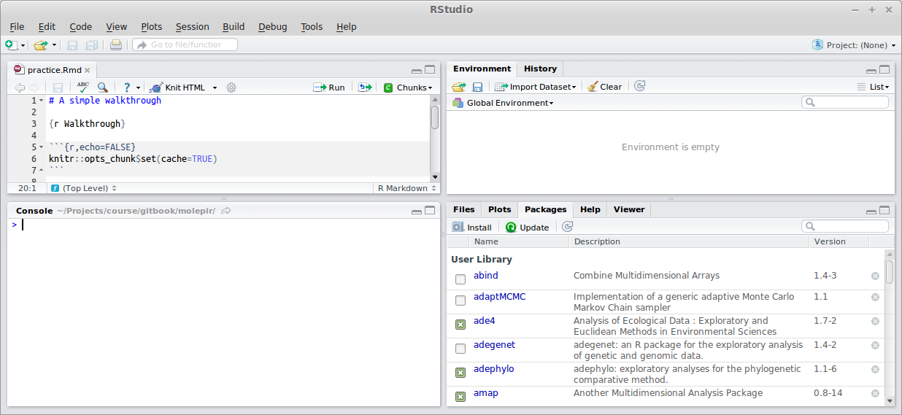
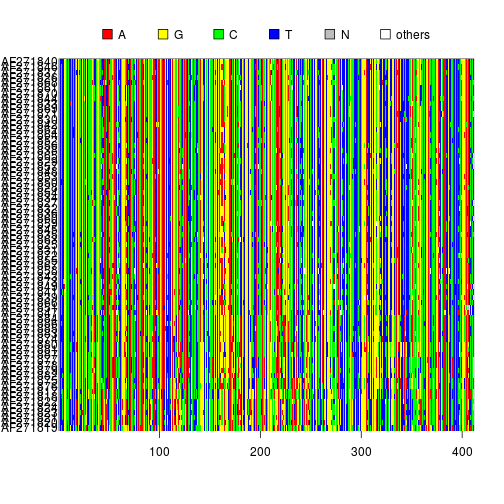
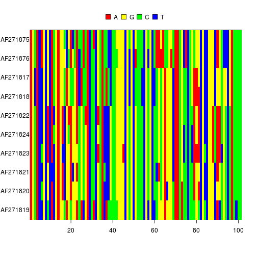

# A simple walkthrough


## Let's make a tree

In order to help familiarise yourself with R and RStudio, we'll make a tree.

## First steps

- Open RStudio.
- Change to the working directory where your files will be kept.
    - Session > Set Working Directory > Choose Directory

## Installing libraries

We will use several libraries in this course, most of which have already been installed for you. However, it's good to know how to install them yourself.

- Use the ```install.packages``` command.
- Use Packages tab in the lower left hand panel.



## Loading libraries

Most libraries are not loaded by default, so you'll need to load them yourself. Try the following command


```r
library(ape)
```

## Sequence data

Most of the time, we will use FASTA formatted sequence data.

```
>SequenceName
CTCTTGGCTCTGTTGTCCTGTTTGACCATCCCAGCTTCCGCTTATGAAG
CATGTCACAAACGACTGCTCCAACTCGAGCATTGTCTATGAGGCAGCGG
TGCGTGCCCTGTGTTCGGGAGGGCAACACCTCCCGCTGCTGGGTATCGC
AACTCCAGTGTCCCCACCACGACGATACGGCGCCATGTCGATTTGCTCG
GCCATGTACGTGGGGGATCTCTGCGGATCTGTTTTCCTCGTCTCCCAAC
TATCAGACGGTACAGGACTGCAATTGTTCAATCTATCCTGGCCACGTAA
```

## Reading in sequence data

- A dataset we will use throughout is of partial hepatitis C sequences of the Core/E1 region, sampled from Egypt (Ray, Arthur, Carella, Bukh, and Thomas, 2000).


```r
myseqs <- read.dna("ray2000.fas",format="fasta",as.matrix=TRUE)
```

- R uses ```<-``` to assign to names
- The function in R to read in DNA sequences is ```read.dna```
- We can learn more about this function by typing ```?read.dna```
- If we can't remember the name, we could search for matches e.g. ```??dna```
- The help tells us that we have to specify the format, as well as whether to read the data into a matrix
- These sequences are aligned, so we set ```use.matrix=TRUE```

## What happened?

Nothing happened! This is because nothing went wrong. If we want to see the data, we can just type in the name we gave it.


```r
myseqs
```

```
## 71 DNA sequences in binary format stored in a matrix.
## 
## All sequences of same length: 411 
## 
## Labels: AF271819 AF271820 AF271821 AF271823 AF271824 AF271822 ...
## 
## Base composition:
##     a     c     g     t 
## 0.177 0.305 0.256 0.262
```

## Displaying the alignment


```r
image(myseqs)
```

 

## Displaying part of an alignment


```r
image(myseqs[1:10,100:200])
```

 

## Generating a distance matrix

- Several algorithmic approaches for obtaining genetic distances
- The command below generates a distance matrix using the Tamura-Nei (1993) distance


```r
myseqs.dist <- dist.dna(myseqs,model="TN93")
```

## Reconstructing a neighbour joining tree

- The ```nj``` command generates a neighbour joining tree from a distance matrix.


```r
myseqs.njtree <- nj(myseqs.dist)
myseqs.njtree
```

```
## 
## Phylogenetic tree with 71 tips and 69 internal nodes.
## 
## Tip labels:
## 	AF271819, AF271820, AF271821, AF271823, AF271824, AF271822, ...
## 
## Unrooted; includes branch lengths.
```

## Plotting a tree


```r
plot(myseqs.njtree,type="unrooted",cex=0.5)
```

 

## Questions and concerns: implementation

- 'I can't remember all that typing'...
- 'I can make a tree more easily using a graphical interface, such as in MEGA'...

## Literate programming

- R and RStudio have good support for *literate programming*
    - Mixture of text and code
- Rather than type everything from scratch, we place all commands in a text file
