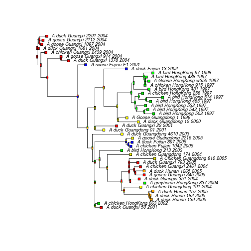

# 'Mugration' exercise


Load the libraries.


```r
library(ape)
library(phangorn)
library(ggtree)
```

```
## 
## Attaching package: 'ggtree'
## 
## The following objects are masked from 'package:IRanges':
## 
##     collapse, expand
## 
## The following object is masked from 'package:phangorn':
## 
##     getRoot
```

Load the FASTA data.


```r
myseqs <- read.dna("H5N1.fas",format="fasta")
```


```r
mytree  <- nj(dist.dna(myseqs,model="TN93"))
```

Starting with the neighbour joining tree, we reconstruct a maximum likelihood tree, as we did before. Note that we get a warning about negative branch lengths in the NJ tree, which aren't allowed in the ML tree.


```r
myseqs.phydat <- as.phyDat(myseqs)
myseqs.gtrig <- pml(mytree,myseqs.phydat,model="GTR+I+G",k=4)
```

```
## Warning in pml(mytree, myseqs.phydat, model = "GTR+I+G", k = 4): negative
## edges length changed to 0!
```

```r
myseqs.gtrig <- optim.pml(myseqs.gtrig,optNni=TRUE,optBf=TRUE,optQ=TRUE,optInv=TRUE,optGamma=TRUE,optEdge=TRUE,optRate=FALSE)
```

```
## optimize edge weights:  -6050.051 --> -6038.844 
## optimize base frequencies:  -6038.844 --> -5986.777 
## optimize rate matrix:  -5986.777 --> -5728.631 
## optimize invariant sites:  -5728.631 --> -5717.886 
## optimize shape parameter:  -5717.886 --> -5717.886 
## optimize edge weights:  -5717.886 --> -5717.684 
## optimize topology:  -5717.684 --> -5704.969 
## optimize topology:  -5704.969 --> -5704.969 
## 4 
## optimize base frequencies:  -5704.969 --> -5704.725 
## optimize rate matrix:  -5704.725 --> -5704.684 
## optimize invariant sites:  -5704.684 --> -5704.657 
## optimize shape parameter:  -5704.657 --> -5704.657 
## optimize edge weights:  -5704.657 --> -5704.657 
## optimize topology:  -5704.657 --> -5704.657 
## 0 
## optimize base frequencies:  -5704.657 --> -5704.655 
## optimize rate matrix:  -5704.655 --> -5704.655 
## optimize invariant sites:  -5704.655 --> -5704.655 
## optimize shape parameter:  -5704.655 --> -5704.655 
## optimize edge weights:  -5704.655 --> -5704.655 
## optimize base frequencies:  -5704.655 --> -5704.655 
## optimize rate matrix:  -5704.655 --> -5704.655 
## optimize invariant sites:  -5704.655 --> -5704.655 
## optimize shape parameter:  -5704.655 --> -5704.654 
## optimize edge weights:  -5704.654 --> -5704.654 
## optimize base frequencies:  -5704.654 --> -5704.654 
## optimize rate matrix:  -5704.654 --> -5704.654 
## optimize invariant sites:  -5704.654 --> -5704.654 
## optimize shape parameter:  -5704.654 --> -5704.654 
## optimize edge weights:  -5704.654 --> -5704.654 
## optimize base frequencies:  -5704.654 --> -5704.654 
## optimize rate matrix:  -5704.654 --> -5704.654 
## optimize invariant sites:  -5704.654 --> -5704.654 
## optimize shape parameter:  -5704.654 --> -5704.653 
## optimize edge weights:  -5704.653 --> -5704.653 
## optimize base frequencies:  -5704.653 --> -5704.653 
## optimize rate matrix:  -5704.653 --> -5704.653 
## optimize invariant sites:  -5704.653 --> -5704.653 
## optimize shape parameter:  -5704.653 --> -5704.653 
## optimize edge weights:  -5704.653 --> -5704.653 
## optimize base frequencies:  -5704.653 --> -5704.653 
## optimize rate matrix:  -5704.653 --> -5704.653 
## optimize invariant sites:  -5704.653 --> -5704.653 
## optimize shape parameter:  -5704.653 --> -5704.653 
## optimize edge weights:  -5704.653 --> -5704.653 
## optimize base frequencies:  -5704.653 --> -5704.653 
## optimize rate matrix:  -5704.653 --> -5704.653 
## optimize invariant sites:  -5704.653 --> -5704.653 
## optimize shape parameter:  -5704.653 --> -5704.652 
## optimize edge weights:  -5704.652 --> -5704.652 
## optimize base frequencies:  -5704.652 --> -5704.652 
## optimize rate matrix:  -5704.652 --> -5704.652 
## optimize invariant sites:  -5704.652 --> -5704.652 
## optimize shape parameter:  -5704.652 --> -5704.652 
## optimize edge weights:  -5704.652 --> -5704.652
```

```r
myseqs.mltree <- myseqs.gtrig$tree
```

We need to root the tree in order to do ancestral reconstruction. We use ```rtt```, but in principle, we could use any method we discussed before. We scan the names of the tip labels, to get the tip dates and location.


```r
info <- scan(what=list(character(),character(),character(),character(),integer()),sep="_",quote="\"",text=paste(myseqs.mltree$tip.label,collapse="\n"),quiet=TRUE)
tipdates <- as.double(info[[5]])
tipdates
```

```
##  [1] 2005 2005 2002 2001 2005 2005 2004 2004 2003 2001 2000 1996 2005 2005
## [15] 2004 2004 2004 2004 2004 2004 2004 2004 2004 2001 2001 2004 2003 2002
## [29] 1998 1997 1997 1997 1997 1997 1997 1997 1997 1997 1997 2005 2005 2005
## [43] 2005
```

Now we can root with ```rtt```.


```r
myseqs.mltree.rooted <- rtt(myseqs.mltree,tipdates)
```

Now we can extract the location, and reconstruct the changes in state.


```r
info <- scan(what=list(character(),character(),character(),character(),integer()),sep="_",quote="\"",text=paste(myseqs.mltree.rooted$tip.label,collapse="\n"),quiet=TRUE)
mylocation <- as.factor(info[[3]])
mylocation
```

```
##  [1] Fujian    Fujian    Fujian    Fujian    Guangdong Guangdong Guangdong
##  [8] Guangdong Guangdong Guangdong Guangdong Guangdong Guangxi   Guangxi  
## [15] Guangxi   Guangxi   Guangxi   Guangxi   Guangxi   Guangxi   Guangxi  
## [22] Guangxi   Guangxi   Guangxi   Guangxi   HongKong  HongKong  HongKong 
## [29] HongKong  HongKong  HongKong  HongKong  HongKong  HongKong  HongKong 
## [36] HongKong  HongKong  HongKong  HongKong  Hunan     Hunan     Hunan    
## [43] Hunan    
## Levels: Fujian Guangdong Guangxi HongKong Hunan
```


```r
myseqs.mltree.rooted$edge.length[myseqs.mltree.rooted$edge.length<0.00000001] <- 0.00000001
myseqs.ace <- ace(mylocation,myseqs.mltree.rooted,type="discrete",method="ML",model="ER")
```


```r
myseqs.ace
```

```
## 
##     Ancestral Character Estimation
## 
## Call: ace(x = mylocation, phy = myseqs.mltree.rooted, type = "discrete", 
##     method = "ML", model = "ER")
## 
##     Log-likelihood: -45.95053 
## 
## Rate index matrix:
##           Fujian Guangdong Guangxi HongKong Hunan
## Fujian         .         1       1        1     1
## Guangdong      1         .       1        1     1
## Guangxi        1         1       .        1     1
## HongKong       1         1       1        .     1
## Hunan          1         1       1        1     .
## 
## Parameter estimates:
##  rate index estimate std-err
##           1  19.4038  4.0889
## 
## Scaled likelihoods at the root (type '...$lik.anc' to get them for all nodes):
##       Fujian    Guangdong      Guangxi     HongKong        Hunan 
## 1.335464e-05 1.248930e-05 9.999497e-01 1.231242e-05 1.216222e-05
```


```r
plot(myseqs.mltree.rooted, type="p",label.offset=0.0025,cex=0.75)
co <- c("blue", "yellow","red","green","orange")
tiplabels(pch = 22, bg = co[as.numeric(mylocation)], cex = 1.0)
nodelabels(thermo = myseqs.ace$lik.anc, piecol = co, cex = 0.25)
```

 
